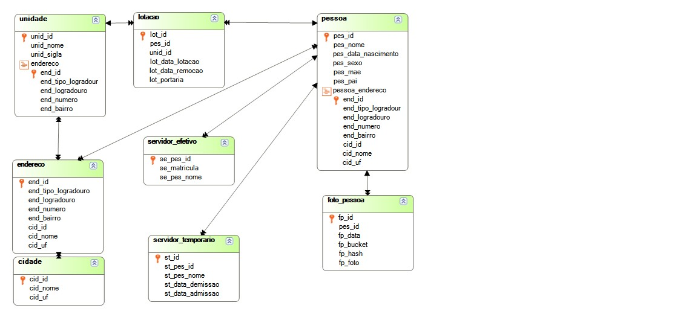
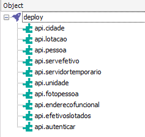

# Seletivo Seplag-MT Genexus

## Inscrição do candidato:

- **Processo Seletivo**: PSS 02/2025/SEPLAG (Analista de TI - Perfil Sênior)
- **Inscrição**: 
- **Nome**: DIEGO DONIZETE CORREA DA SILVA
- **Perfil**: Desenvolvedor Genexus - Sênior


## PROJETO PRÁTICO IMPLEMENTAÇÃO BACK-END GENEXUS


---


Este projeto consiste na implementação de uma API REST para gerenciamento de servidores (efetivos e temporários), unidades e lotações, conforme diagrama de banco de dados fornecido. A solução utiliza containers Docker para **PostgreSQL** e **MinIO**, com orquestração via **Docker Compose**, aplicação desenvolvida com **Genexus 18 U10**, utilizando utilizando **Java 17**.


---

### Tecnologias Utilizadas

 - **Genexus 18 UP10** com Java **JDK 17.0.12** 
 - **Banco de Dados: PostgreSQL 17** (container) 
 - **Armazenamento de Objetos: MinIO** (container) 
 - **Servidor de Aplicação: Tomcat 11** (container) 
 - **Orquestração: Docker Compose** 
 - **Autenticação: JWT** (JSON Web Tokens) 

---

### Arquivos do projeto
1. Clonar o repositório
   1. doc pasta contendo os arquivos swagger-ui
   2. kb pasta contendo o arquivo KB
   3. sql pasta contendo o arquivo script_create_tables.sql
   4. tomcat pasta contendo o war da aplicação explodido
   5. war pasta contendo o arquivo seletivojava.war
2. Navegue até a pasta `sandbox` do projeto
3. Acessar o diretório sandbox
4. Execute o seguinte comando no terminal dentro dessa pasta:
    ```sh
    docker-compose up -d
    ```
    
  Esta ação iniciará os seguintes containers:
   - MinIO
   - PostgreSQL
   - Tomcat 11
   

O ambiente estará disponível nos seguintes endereços:

- **PostgreSQL**: `localhost:5432` (usuário: `postgres`, senha: `123456`)
- **MinIO Console**: `localhost:9001` (usuário: `minioadmin`, senha: `minioadmin`)
- **Tomcat 11**: `localhost:8080`

### **Endpoints da API**

Na aplicação teremos o swagger-ui que ustilizamos para teste dos api:

### **swagger-ui**
    
    http://localhost:8080/seletivojava/swagger-ui/

Este que foi configurado com os arquivos YAML que estão disponivel no diretório `doc` listado a baixo:

- `api.autenticar.yaml`
- `api.cidade.yaml`
- `api.efetivoslotados.yaml`
- `api.enderecofuncional.yaml`
- `api.fotopessoa.yaml`
- `api.lotacao.yaml`
- `api.pessoa.yaml`
- `api.servefetivo.yaml`
- `api.servidortemporario.yaml`
- `api.unidade.yaml`

Assim podemos executar o passo a passo abaixo para testar selecionando o api na combombox **Select a definition**.

### **Autenticação**

**Autenticar obter o Token** `POST /login` - Metodo gerar o token de Autenticação via JWT (expira em 5 minutos). [api.autenticar.yaml]

### **CRUDs**

- **Servidores Efetivos**: `GET|POST|PUT|DELETE /servefetivo` [api.servefetivo.yaml]
- **Servidores Temporários**: `GET|POST|PUT|DELETE /servidoretemporario` [api.servidortemporario.yaml]
- **Unidades**: `GET|POST|PUT|DELETE /unidade` [api.unidade.yaml]
- **Lotação**: `GET|POST|PUT|DELETE /lotacao` [api.lotacao.yaml]
- **Cidades**: `GET|POST|PUT|DELETE /cidade` [api.cidade.yaml]


### **Funcionalidades Implementadas**

1. **Autenticação e Autorização**:
   - JWT com expiração em 5 minutos
   - Possibilidade de refresh token 5 minutos

2. **CRUDs Completos**:
   - Todas as operações básicas para as entidades principais
   - Validação de dados e tratamento de erros

3. **Paginação**:
   - Todos os endpoints de listagem suportam paginação via query params (`?Pagina=1&Pagesize=10`)

4. **Upload de Fotos**:
   - Armazenamento no MinIO
   - Geração de links temporários com expiração
   - Metadados armazenados no PostgreSQL

5. **Consultas Específicas**:
   - Servidores por unidade com dados calculados (idade)
   - Endereço funcional por nome do servidor

---

# Considerações Finais

Esta implementação atende todos os requisitos solicitados, incluindo:
- Autenticação JWT com expiração e renovação
- CRUDs completos para todas as entidades principais
- Paginação em todas as consultas
- Upload e recuperação segura de fotos via MinIO
- Consultas específicas conforme solicitado
- Orquestração via Docker Compose

O código está organizado seguindo boas práticas de desenvolvimento e pode ser facilmente extendido para incluir novas funcionalidades.

---

# Anexos

## Diagrama de Arquitetura



## Objetos

